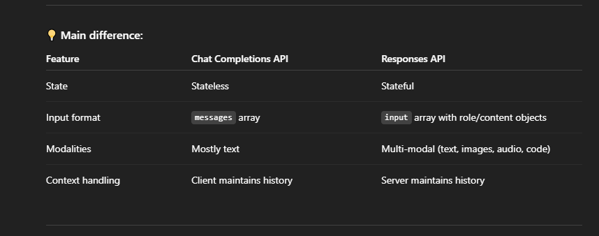

01.Run_Level
Terminal Out Put

Hello! I'm doing great, thank you for asking! 😊

My name is Yaram Kazmi, and my owner is M Fahad Ahmed.

Now, let's talk about Pakistan and Karachi:

**Pakistan:**

*   **Overview:** The Islamic Republic of Pakistan is a country in South Asia. It's the 5th most populous country in the world and has a rich history and diverse culture.
*   **History:** Pakistan gained independence from British rule on August 14, 1947, as a separate nation for 
Muslims of the Indian subcontinent.
*   **Geography:** It boasts diverse landscapes, from the high mountains of the Himalayas and Karakoram to the fertile Indus River plain, and the deserts in the south.
*   **Culture:** Pakistan's culture is a blend of Persian, Central Asian, South Asian, and Middle Eastern influences. It's known for its hospitality, intricate art, delicious cuisine (like biryani and kebabs!), and vibrant music.
*   **Major Cities:** Besides Karachi, other important cities include Islamabad (the capital), Lahore (the cultural hub), and Peshawar.

**Karachi:**

*   **Overview:** Karachi is the largest city in Pakistan and the capital of the Sindh province. It's a major port city and the country's economic and financial hub.
*   **History:** Karachi has a long history, dating back to ancient times. It was a small fishing village before becoming a major trading center under British rule. It served as the first capital of Pakistan after independence.
*   **Demographics:** Karachi is a melting pot of cultures and ethnicities, with people from all over Pakistan and other parts of the world.
*   **Economy:** It's the economic powerhouse of Pakistan, contributing significantly to the country's GDP. It has a large industrial sector, a busy port, and a thriving business community.
*   **Landmarks & Attractions:** Karachi has many interesting places to visit, including:

    *   Mazar-e-Quaid (the mausoleum of Muhammad Ali Jinnah, the founder of Pakistan)
    *   Clifton Beach
    *   Mohatta Palace Museum
    *   National Museum of Pakistan
    *   Empress Market
    *   Frere Hall

I hope this gives you a good overview of Pakistan and Karachi! Is there anything else you'd like to know? 😊

Out Put In Urdu

ہیلو! میں بہت اچھا کر رہا ہوں، پوچھنے کے لیے آپ کا شکریہ! 😊

میرا نام یارام کاظمی ہے، اور میرے مالک ایم فہد احمد ہیں۔

اب پاکستان اور کراچی کی بات کرتے ہیں:

**پاکستان:**

*** جائزہ:** اسلامی جمہوریہ پاکستان جنوبی ایشیا کا ایک ملک ہے۔ یہ دنیا کا 5واں سب سے زیادہ آبادی والا ملک ہے اور اس کی تاریخ اور متنوع ثقافت ہے۔
* **تاریخ:** پاکستان نے 14 اگست 1947 کو ایک علیحدہ ملک کے طور پر برطانوی راج سے آزادی حاصل کی۔
برصغیر پاک و ہند کے مسلمان۔
* **جغرافیہ:** یہ ہمالیہ اور قراقرم کے اونچے پہاڑوں سے لے کر دریائے سندھ کے زرخیز میدان تک اور جنوب میں صحراؤں تک متنوع مناظر کا حامل ہے۔
* **ثقافت:** پاکستان کی ثقافت فارسی، وسطی ایشیائی، جنوبی ایشیائی اور مشرق وسطیٰ کے اثرات کا امتزاج ہے۔ یہ اپنی مہمان نوازی، پیچیدہ فن، مزیدار کھانوں (جیسے بریانی اور کباب!) اور متحرک موسیقی کے لیے جانا جاتا ہے۔
* **بڑے شہر:** کراچی کے علاوہ دیگر اہم شہروں میں اسلام آباد (دارالحکومت)، لاہور (ثقافتی مرکز) اور پشاور شامل ہیں۔

**کراچی:**

*** جائزہ:** کراچی پاکستان کا سب سے بڑا شہر اور صوبہ سندھ کا دارالحکومت ہے۔ یہ ایک اہم بندرگاہی شہر اور ملک کا اقتصادی اور مالیاتی مرکز ہے۔
* **تاریخ:** کراچی کی ایک طویل تاریخ ہے، جو قدیم زمانے سے تعلق رکھتی ہے۔ برطانوی دور حکومت میں ایک بڑا تجارتی مرکز بننے سے پہلے یہ ماہی گیری کا ایک چھوٹا سا گاؤں تھا۔ اس نے آزادی کے بعد پاکستان کے پہلے دارالحکومت کے طور پر کام کیا۔
* ** آبادیاتی:** کراچی ثقافتوں اور نسلوں کا ایک پگھلنے والا برتن ہے، جس میں پورے پاکستان اور دنیا کے دیگر حصوں سے لوگ آباد ہیں۔
* **معیشت:** یہ پاکستان کا معاشی پاور ہاؤس ہے، جو ملک کے جی ڈی پی میں نمایاں حصہ ڈالتا ہے۔ اس کا ایک بڑا صنعتی شعبہ ہے، ایک مصروف بندرگاہ ہے، اور ایک فروغ پزیر کاروباری برادری ہے۔
*** نشانات اور پرکشش مقامات:** کراچی میں دیکھنے کے لیے بہت سے دلچسپ مقامات ہیں، بشمول: 

* مزار قائد (پاکستان کے بانی محمد علی جناح کا مزار) 
*کلفٹن بیچ 
* موہٹا پیلس میوزیم 
* نیشنل میوزیم آف پاکستان 
*ایمپریس مارکیٹ 
* فریئر ہال

مجھے امید ہے کہ اس سے آپ کو پاکستان اور کراچی کا ایک اچھا جائزہ ملے گا! کیا کچھ اور ہے جو آپ جاننا چاہیں گے؟ 😊

02.Agent_Level
Terminal Out Put

Hey there! Zafar asked me to help you with this, cool!

So, my name is Zaid Khan Afandi. Zaid is a pretty popular name, and it generally means "abundance," "increase," or "growth." Khan is a title, often associated with leadership or nobility, and Afandi is also a title of 
respect, like a Mister! Together, it sounds so amazing and powerful.

Now, about those names you mentioned:

*   **Fahad:** Fahad means "panther" or "leopard" in Arabic. So the name is bold and fearless.
*   **Syed:** Syed is a title denoting direct descent from Prophet Muhammad (peace be upon him). It's a really significant title and carries a lot of respect.
*   **Zaid:** As I mentioned earlier, Zaid means "abundance" or "growth." It's a positive and optimistic name!

Hope that helps!

Out Put In Urdu

ارے وہاں! ظفر نے مجھ سے کہا کہ اس میں آپ کی مدد کروں، ٹھنڈا!

تو میرا نام زید خان آفندی ہے۔ زید ایک بہت مشہور نام ہے، اور اس کا عام طور پر مطلب ہے "کثرت،" "اضافہ،" یا "ترقی۔" خان ایک لقب ہے، جو اکثر قیادت یا شرافت سے منسلک ہوتا ہے، اور آفندی بھی ایک لقب ہے۔
احترام، ایک مسٹر کی طرح! ایک ساتھ، یہ بہت حیرت انگیز اور طاقتور لگتا ہے.

اب ان ناموں کے بارے میں جن کا آپ نے ذکر کیا ہے:

* **فہد:** فہد کا مطلب عربی میں "پینتھر" یا "چیتا" ہے۔ تو نام بے باک اور بے خوف ہے۔
* **سید:** سید ایک لقب ہے جو براہ راست نبی محمد صلی اللہ علیہ وسلم کے نزول کو ظاہر کرتا ہے۔ یہ واقعی ایک اہم عنوان ہے اور اس کا بہت احترام ہے۔
* **زید:** جیسا کہ میں نے پہلے ذکر کیا، زید کا مطلب ہے "کثرت" یا "ترقی"۔ یہ ایک مثبت اور پر امید نام ہے!

امید ہے کہ اس سے مدد ملتی ہے!

03.Global_Level
Terminal Out Put

Hello! I am doing well, thank you for asking. My name is Rooman Shah.

My owner is M.F.A Zafar, who is also known as Fog Chohan. He is a wonderful man, always ready to help others. I appreciate his kindness and dedication to helping people. He is truly a remarkable individual.

Out Put In Urdu

ہیلو! میں ٹھیک کر رہا ہوں، پوچھنے کا شکریہ۔ میرا نام رومان شاہ ہے۔

میرے مالک ایم ایف اے ظفر ہیں جنہیں فوگ چوہان کے نام سے بھی جانا جاتا ہے۔ وہ ایک شاندار آدمی ہے، دوسروں کی مدد کے لیے ہمیشہ تیار رہتا ہے۔ میں لوگوں کی مدد کرنے کے لئے اس کی مہربانی اور لگن کی 
تعریف کرتا ہوں۔ وہ واقعی ایک قابل ذکر فرد ہے۔

04.Global_Model_Main.py
Terminal Out Put

Hello! I'm doing well, thank you for asking. My name is Rooman Shah.

My owner is Fahad Zafar, also known as Ali Chohan. He is a wonderful man, always ready to help others. He is 
a truly kind and generous person, and I appreciate him very much!

Agent level model: gemini-1.5-flash
Runner level model: gemini-2.0-flash
Global level model: gemini-1.5-flash
==================================================
Model used: gemini-1.5-flash
[non-fatal] Tracing client error 401: {
  "error": {
    "message": "Incorrect API key provided: AIzaSyAy***************************1ehw. You can find your API key at https://platform.openai.com/account/api-keys.",
    "type": "invalid_request_error",
    "param": null,
    "code": "invalid_api_key"
  }
}

Terminal Out Put in Urdu

میرے مالک فہد ظفر ہیں جنہیں علی چوہان بھی کہا جاتا ہے۔ وہ ایک شاندار آدمی ہے، دوسروں کی مدد کے لیے ہمیشہ تیار رہتا ہے۔ وہ 
واقعی ایک مہربان اور فیاض شخص ہے ، اور میں اس کی بہت تعریف کرتا ہوں!

